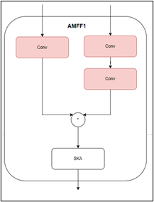
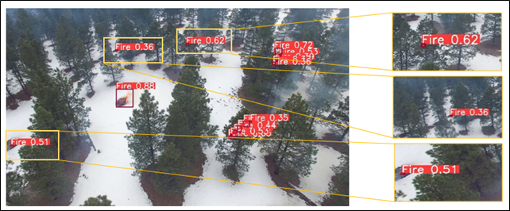
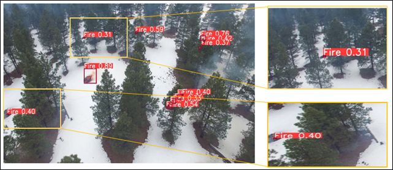
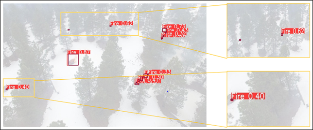

# Modified-YOLO-World

This code is based on the [Ultralytics](https://github.com/ultralytics/ultralytics.git) repository. 

## Features
This version integrates:
- *DCNv3 (Deformable Convolutional Networks v3)*
- *Coordinate Attention*
- *AMFF (Adaptive Multi-Feature Fusion)*

Additionally, a reduced version of the YOLO World architecture is included in the folder [Custom config](https://github.com/Achrefjr1997/Modified-YOLO-World/tree/main/Custom%20config).

## Installation Guide
1. Navigate to the DCNv3 module directory and install it:
   ```bash
   %cd ultralytics/ultralytics/nn/modules/ops_dcnv3
   !python setup.py clean build install
   %cd /ultralytics/
   !pip install -e .

To integrate the *SAHI* (Slicing Aided Hyper Inference) with YOLO World, please use this version: 

```bash
git clone https://github.com/Achrefjr1997/SAHI-World.git
```
which includes YOLO World.

#Proposed architucture :




## Description
This image illustrates the architecture of the CA AMMF reduced YoloWord model.

### Sample Detection Outputs
Here are some sample images showing the detection results of the model:

| Detection Result |
|------------------|
| |
| |
| |

## Demo

You can view the demo of this project in the following link:

[Demo Notebook](https://colab.research.google.com/drive/1-gVGagOBuP4T8IUP-wBbZh4D81298aGZ?usp=sharing)


> **Warning:** This code runs only on GPU due to the use of DCNv3 (Deformable Convolutional Networks v3). Please ensure your environment is set up with a compatible GPU.
